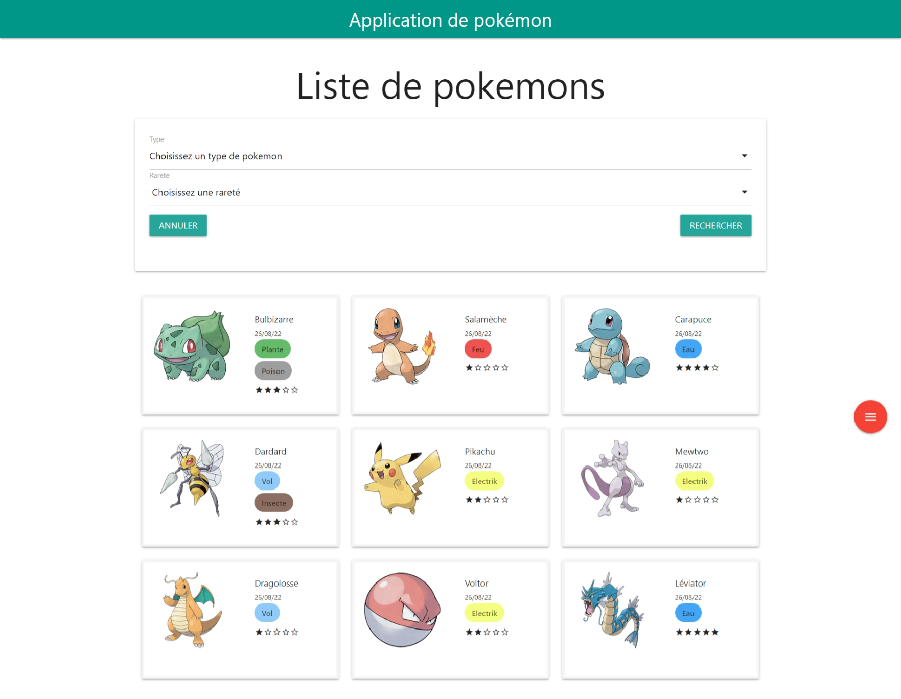
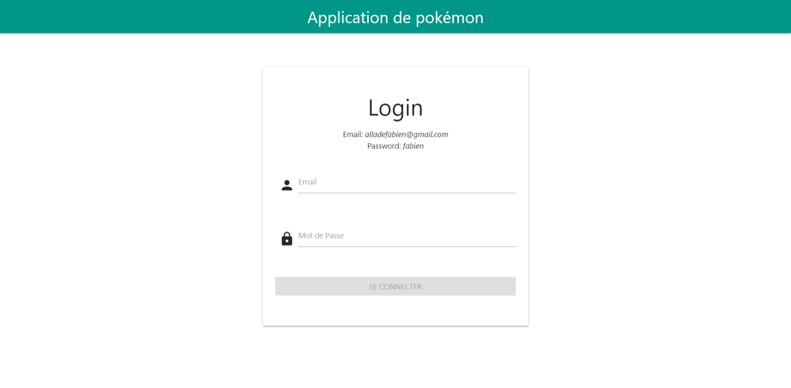
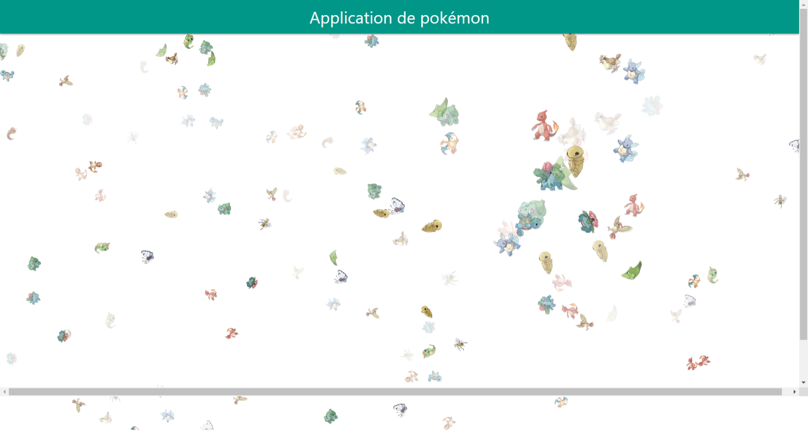
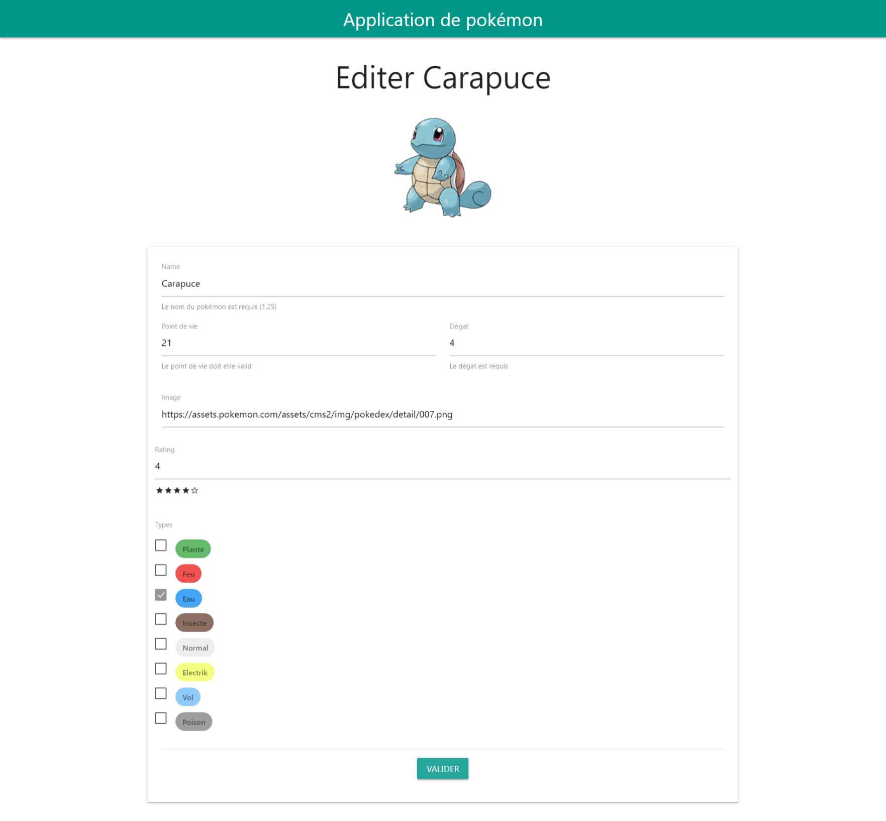

# Pokemon App
Pokemon App est une application qui possedent plusieurs petites
fonctionnalités comme:
- un crud basique
- une page de details
- une page album qui présente de façon aléatoire des images
  de pokemon
- une page d'affichage et de filtrages des pokemons présent

## Login
Les informations pour la connexion sont inscrit juste au dessus 
du formulaire

## Album Animation Page

## Formulaire pokémon

## Technologie Utilisé
- Angular 13
- Joi
- ng-particules
- materilize css
